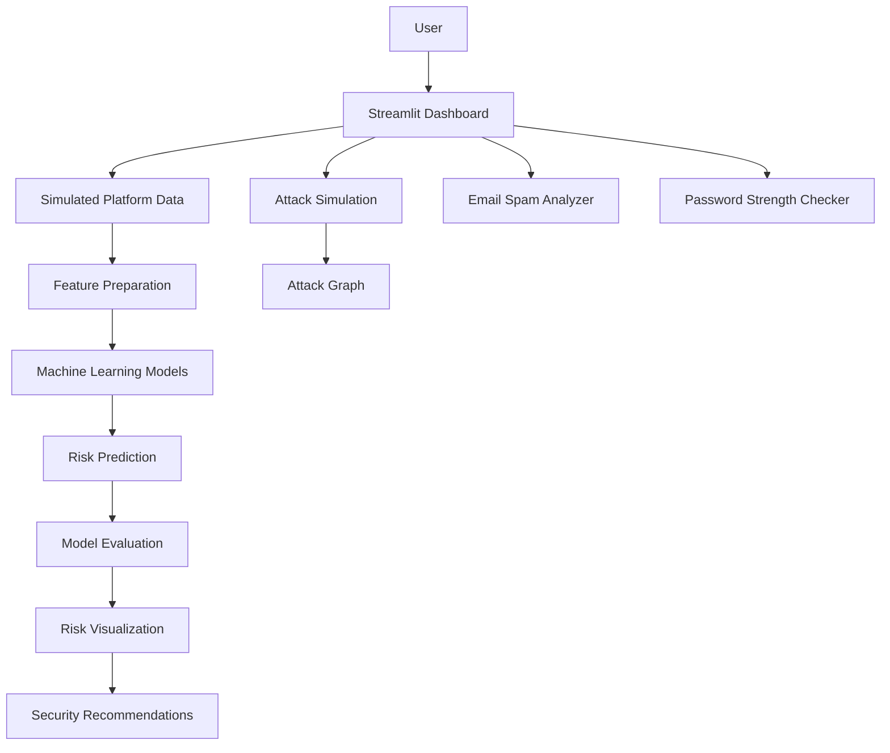

# 🛡️ Cyber AI Dashboard

### Machine-Learning-Powered Cybersecurity Simulation Dashboard

A Streamlit-based cybersecurity dashboard that combines **machine learning, risk scoring, attack-path visualization, phishing simulation, password analysis, and email spam/phishing detection** into an interactive security analysis platform.

> ⚠️ **Note:** This project is an educational cybersecurity simulation. Platform connections and attack scenarios are simulated and do not interact with real social-media accounts.

---

## 🚀 Overview

Modern users interact with multiple online platforms and are exposed to risks such as:

* Password reuse
* Weak authentication
* Phishing
* Credential theft
* Suspicious emails
* Account compromise

**Cyber AI Dashboard** demonstrates how these security signals can be combined into a unified risk-analysis workflow.

The application generates synthetic cybersecurity data, trains multiple machine-learning classification models, compares their predictions and evaluation metrics, and visualizes potential attack paths.

---

## ✨ Features

### 🔌 Simulated Multi-Platform Risk Analysis

Analyze simulated security conditions across:

* Instagram
* Facebook
* Twitter
* LinkedIn
* Email

Each simulated platform generates security indicators such as:

* Number of accounts
* Password reuse
* Two-factor authentication status
* Exposure level
* Phishing exposure

---

### 🧠 Machine Learning Risk Prediction

The dashboard trains and compares **six classification models**:

1. Logistic Regression
2. Random Forest
3. Decision Tree
4. Gradient Boosting
5. Support Vector Machine (SVM)
6. K-Nearest Neighbors (KNN)

Each model produces a predicted high-risk probability.

The dashboard then compares the models and calculates an overall risk score.

---

## 📊 Model Evaluation

The machine-learning models are evaluated using a held-out test dataset.

Evaluation metrics include:

* Accuracy
* Precision
* Recall
* F1 Score
* 5-Fold Cross-Validation Accuracy
* Confusion Matrix

Users can select an individual model and inspect its confusion matrix directly from the dashboard.

> ⚠️ The dataset used for training is synthetically generated for demonstration purposes. Evaluation results therefore should not be interpreted as real-world cybersecurity model performance.

---

## 🔬 Machine Learning Pipeline

```text
Synthetic Data Generation
          ↓
Feature Preparation
          ↓
Train / Test Split
          ↓
Six Classification Models
          ↓
Model Training
          ↓
Risk Probability Prediction
          ↓
Model Evaluation
          ↓
Model Comparison
          ↓
Average Risk Score
          ↓
Dashboard Visualization
```

---

## 📥 Input Features

| Feature    | Description                           |
| ---------- | ------------------------------------- |
| `accounts` | Number of simulated accounts          |
| `reuse`    | Password reuse percentage             |
| `twofa`    | Two-factor authentication status      |
| `exposure` | Simulated exposure level              |
| `phishing` | Simulated phishing exposure           |
| `risk`     | Binary high-risk classification label |

---

## ⚔️ Attack Simulation

The dashboard provides simulated attack scenarios for different platforms.

Examples include:

```text
Phishing
   ↓
Credential Theft
   ↓
Account Takeover
```

Other scenarios include:

* Fake friend → Malware link → Profile hijack
* DM scam → Link click → Account compromise
* Malicious link → Session hijack
* Fake recruiter → Data theft

These scenarios are **simulations only** and do not perform real attacks.

---

## 🕸️ Attack Graph

NetworkX is used to construct a directed attack graph based on simulated security conditions.

Example:

```text
User
 ↓
Email
 ↓
Phishing
 ↓
Credentials
 ↓
All Accounts
```

The graph changes based on factors such as:

* Password reuse
* Phishing exposure
* Two-factor authentication status

---

## 📧 Email Spam & Phishing Analyzer

The dashboard includes a **safe demonstration email analyzer**.

Users can:

1. Select a sample email.
2. Review its subject and content.
3. Analyze the message.
4. Receive a risk score.
5. View detected suspicious indicators.
6. Receive a security recommendation.

The analyzer checks for indicators such as:

* Urgency language
* Suspicious calls to action
* Password requests
* Account verification requests
* Prize/scam language
* Financial language
* Promotional language

### Example classifications

```text
🚨 SPAM / PHISHING
⚠️ SUSPICIOUS
✅ LIKELY LEGITIMATE
```

> The current implementation is a rule-based demonstration and does not connect to or access a user's real email inbox.

---

## 🔑 Password Strength Checker

The dashboard provides a basic password-strength assessment based on:

* Password length
* Presence of digits
* Uppercase characters
* Special characters

The password is classified as:

```text
Weak
Moderate
Strong
```

> Passwords are processed locally by the application and are not intentionally stored by the dashboard.

---

## 🛡️ Security Recommendations

Based on the calculated platform risk, the dashboard provides security recommendations such as:

* Enable two-factor authentication
* Change reused passwords
* Improve account security
* Verify suspicious emails
* Avoid sharing sensitive credentials

---

## 🏗️ Architecture



---

## 📊 Screenshots

### Dashboard Overview


### AI/ML Risk Prediction


### Attack Simulation & Attack Graph


### Email Spam Analysis


### Password Strength Checker


---

## 🛠️ Tech Stack

### Programming Language

* Python

### Framework

* Streamlit

### Machine Learning

* Scikit-learn

### Data Processing

* NumPy
* Pandas

### Visualization

* Plotly

### Graph Analysis

* NetworkX

---

## 📂 Project Structure

```text
Cyber-AI-Dashboard/
│
├── app.py
├── README.md
├── requirements.txt
├── .gitignore
│
└── assets/
    ├── dashboard-overview.png
    ├── risk-prediction.png
    ├── attack-graph.png
    ├── email-spam.png
    └── password-strength.png
```

---

## ⚙️ Installation

### 1. Clone the repository

```bash
git clone https://github.com/Adrija-dotcom/Cyber-AI-Dashboard.git
cd Cyber-AI-Dashboard
```

### 2. Create a virtual environment

```bash
python -m venv .venv
```

### 3. Activate the environment

#### Windows

```bash
.venv\Scripts\activate
```

#### macOS / Linux

```bash
source .venv/bin/activate
```

### 4. Install dependencies

```bash
pip install -r requirements.txt
```

### 5. Run the application

```bash
streamlit run app.py
```

The dashboard will open in your browser.

---

## 📦 Requirements

The project uses:

```text
streamlit
numpy
pandas
plotly
networkx
scikit-learn
```

---

## 🔐 Security & Privacy

This project is designed as a cybersecurity simulation and does not perform real attacks.

Important considerations:

* Platform connections are simulated.
* The application does not require social-media credentials.
* The email analyzer does not connect to a real inbox.
* No real account takeover or exploitation is performed.
* Do not enter real passwords into demonstration environments.

---

## ⚠️ Limitations

This project is primarily an educational and portfolio demonstration.

Current limitations include:

* Training data is synthetically generated.
* Risk labels are generated from predefined rules.
* Attack scenarios are simulated.
* The email analyzer uses keyword-based detection.
* The password checker is a basic heuristic.
* Model performance on synthetic data does not represent production cybersecurity performance.
* The dashboard does not perform real-time threat detection.

---

## 🔮 Future Scope

Potential improvements include:

* Real cybersecurity datasets
* TF-IDF + machine-learning email classification
* Transformer-based phishing detection
* Real-time threat intelligence
* Explainable AI using SHAP
* More advanced attack-path modeling
* User authentication and role-based access
* Persistent risk history
* Cloud deployment
* Automated security reports
* Integration with SIEM platforms
* More sophisticated password-risk analysis

---

## 🎯 Target Audience

This project can be useful for demonstrating concepts related to:

* Machine Learning
* Cybersecurity
* Security Analytics
* Risk Assessment
* Data Visualization
* Python Development
* Streamlit Application Development

---

## 👩‍💻 Author

**Adrija Saha**

Computer Applications Student | AI & Cybersecurity Enthusiast

GitHub:
https://github.com/Adrija-dotcom

---

## 📄 License

This project is intended for educational and portfolio purposes.
